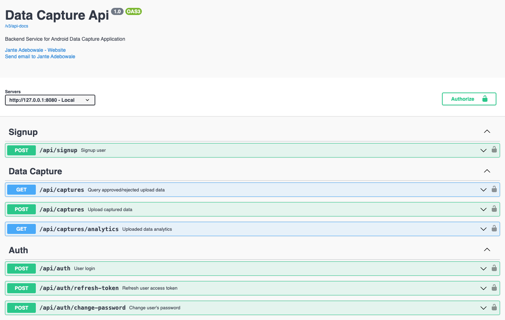

# data-capture-service
Data Capture Service is the backend service for an Android Data capture application I built entirely with kotlin and jetpack compose, It's available [here](https://github.com/jante-adebowale/data-capture).
This service uses an in-memory database ([H2](https://www.h2database.com/)) which makes it easy and straightforward to run.

## Prerequisites
- Java
- [Spring Boot](https://spring.io/projects/spring-boot)
- [Maven](https://maven.apache.org/guides/index.html)
- [H2](https://www.h2database.com/)
## Tools
- [IntelliJ IDEA](https://www.jetbrains.com/idea/)
- Maven (version >= 4.0.0)
###  Build and Run application
_GOTO >_ **~/absolute-path-to-directory/data-capture-service**  
and try below command in terminal
> **```mvn spring-boot:run```** it will run application as spring boot application

or
> **```mvn clean install```** it will build application and create **jar** file under target directory

Run jar file from below path with given command
> **```java -jar ~/path-to-data-capture-service/target/data-capture-service-0.0.1-SNAPSHOT.jar```**

Or
> run main method from `DataCaptureApiApplication.java` as spring boot application.

---
### For API document using OpenAPI UI

> **http://localhost:8080/swagger-ui/index.html**



---
**Connect with me :**
<p >
  <a href="https://www.youtube.com/@jante-adebowale"></a>
  <a href="https://www.linkedin.com/in/jante-adebowale"></a> 
  <a href="https://www.janteadebowale.com"></a>
</p>


